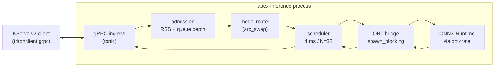

# apex-inference

A lightweight, single-binary ONNX model server written in Rust. Speaks the [KServe v2](https://kserve.github.io/website/master/modelserving/data_plane/v2_protocol/) gRPC protocol, so existing `tritonclient`/KServe clients work unchanged.

Targets the 80% of production inference that NVIDIA Triton over-serves: serve N ONNX models with dynamic batching, observability, and graceful reload — without a 5 GB container, polyglot backend stack, or model-registry ops surface.

```
single Rust binary  +  ONNX Runtime  +  KServe v2 gRPC  +  Prometheus metrics
```

## Why

Triton is the de facto open-source model server, but its surface area is shaped for the maximalist case. For teams that just want to serve ONNX models with dynamic batching:

- Triton's container is multiple gigabytes; cold starts on serverless GPU are slow.
- The polyglot backend matrix (TensorRT, PyTorch, TF, ONNX, OpenVINO, custom Python/C++ backends) is more surface than most teams need.
- Extending Triton means writing a Python or C++ backend; that's a learning curve most teams can't afford.

apex-inference cuts the surface to one backend, one protocol, one binary. The trade-off is explicit: fewer features for dramatically less operational weight, with parity on the path that matters — `tritonclient.grpc` requests Just Work.

## Architecture



- **Ingress** — `tonic` server implementing the KServe v2 `GRPCInferenceService` trait.
- **Admission** — inline hot-path controller. Two atomic loads + comparisons per request. Background task samples process RSS every 100 ms.
- **Router** — `arc_swap::ArcSwap<ModelRegistry>` for lock-free reads on the request path.
- **Scheduler** — one `tokio` task per model. Time + volume batch trigger via `tokio::select!` with `biased;` for deterministic ordering.
- **ORT bridge** — synchronous `ort::Session::run` dispatched off the async runtime via `spawn_blocking`. All `unsafe` confined to one file (`invoke.rs`).
- **Reload** — SIGHUP rereads the YAML config, diffs against the live registry, loads new models, atomically swaps the registry pointer, drains removed dispatchers in detached tokio tasks.

## Status

**v1 (in progress).** Fixed-shape models (image classifiers, embeddings, tabular) on CPU. The architecture supports ragged-sequence batching (BERT-class encoder models), but the v1 bridge only implements f32 inputs — `i64` token IDs and attention-mask generation land in v1.1 alongside a pooled buffer for the hot path.

| Capability                                  | v1  | Roadmap                |
|---------------------------------------------|-----|------------------------|
| KServe v2 gRPC (`ModelInfer` + health)      | ✓   |                        |
| Dynamic batching (time + volume)            | ✓   |                        |
| Multi-model from static config              | ✓   |                        |
| SIGHUP reload with graceful drain           | ✓   |                        |
| Prometheus metrics + structured tracing     | ✓   |                        |
| Fixed-shape models (FP32)                   | ✓   |                        |
| Ragged / sequence batching, attention masks |     | v1.1                   |
| INT64 / FP16 dtypes                         |     | v1.1                   |
| Pre-allocated buffer pool (zero-alloc hot)  |     | v1.1 (with benchmarks) |
| CUDA execution provider                     |     | v1.2                   |
| HTTP/REST shim                              |     | v1.2                   |
| Dynamic model registration via REST         |     | non-goal               |
| Model ensembles                             |     | non-goal               |

## Quickstart

```bash
# Build (downloads ONNX Runtime binaries on first build)
cargo build --release

# Run with the example config
./target/release/apex-inference --config examples/config.yaml
```

The example config declares two models. Point `path:` at real `.onnx` files before running. Defaults: gRPC on `:9000`, Prometheus metrics on `:9090/metrics`.

A KServe v2 client (any language) can now hit the server. Python with `tritonclient`:

```python
import numpy as np
import tritonclient.grpc as grpcclient

client = grpcclient.InferenceServerClient("localhost:9000")
inp = grpcclient.InferInput("input", [1, 3, 224, 224], "FP32")
inp.set_data_from_numpy(np.random.rand(1, 3, 224, 224).astype(np.float32))

resp = client.infer("resnet50", inputs=[inp])
print(resp.as_numpy("output").shape)
```

The same code that works against Triton works against apex-inference. That's the "drop-in" claim.

## Configuration

```yaml
server:
  listen: "0.0.0.0:9000"
  request_timeout_secs: 30
  shutdown_grace_secs: 30
  max_request_bytes: 67108864     # 64 MiB

observability:
  metrics_listen: "0.0.0.0:9090"
  log_format: json                # json | pretty
  log_level: info

admission:
  max_rss_bytes: 8589934592       # 8 GiB
  max_queue_depth: 1024
  rss_sample_interval_ms: 100

models:
  - name: resnet50
    version: "1"
    path: /models/resnet50.onnx
    kind: fixed_shape
    max_batch_size: 32
    max_queue_delay_us: 4000
    intra_op_threads: 4
```

Reload models without dropping inflight requests:

```bash
kill -HUP $(pgrep apex-inference)
```

## Observability

`GET /metrics` exposes Prometheus metrics for every layer:

| Metric                                       | What it measures                            |
|----------------------------------------------|---------------------------------------------|
| `apex_grpc_requests_total`                   | RPCs by code, by name                       |
| `apex_grpc_request_duration_seconds`         | End-to-end RPC wall time                    |
| `apex_dispatcher_batch_size`                 | Histogram of dispatched batch sizes         |
| `apex_dispatcher_wait_time_ms`               | Time the first-in-batch request waited      |
| `apex_dispatcher_dispatch_reason_total`      | Batch fired by `size` vs `time` trigger     |
| `apex_admission_decisions_total`             | Admit / reject_memory / reject_queue_depth  |
| `apex_admission_check_duration_nanoseconds`  | Admission hot-path latency (target < 100 ns)|
| `apex_config_reload_total`                   | Reload outcomes (ok / invalid / load_failed)|

Structured JSON logs via `tracing-subscriber`. Each `ModelInfer` span carries `model`, `model_version`, and a generated `request_id` field, propagated into the dispatcher task.

## Repository layout

```
crates/apex-core/      library — ORT bridge, scheduler, registry, admission, config
crates/apex-server/    binary — KServe v2 gRPC service, main entrypoint, signal handling
proto/                 vendored KServe v2 inference proto
examples/              sample config and client snippets
docs/                  (gitignored: internal design notes)
```

`apex-core` is published as a library so it can be embedded in larger Rust services that want to keep inference in-process.

## License

Dual-licensed under either of:

- Apache License 2.0 ([LICENSE-APACHE](LICENSE-APACHE))
- MIT License ([LICENSE-MIT](LICENSE-MIT))

at your option.
